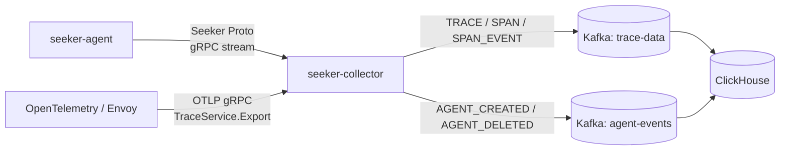

# seeker-collector

Seeker Agent와 OpenTelemetry 호환 클라이언트에서 들어오는 trace 데이터를 수신해 Kafka로 발행하는 수집 서버입니다.
Spring Boot 기반 HTTP API와 별도 gRPC 서버를 함께 띄우며, 수집한 데이터를 ClickHouse 적재 파이프라인이 소비할 수 있는 이벤트 형태로 정규화합니다.

핵심 역할은 아래 세 가지입니다.

- **Seeker 전용 gRPC 수신** - `seeker-agent`가 보내는 client-streaming 데이터를 받아 span, span event, trace 단위로 분리합니다.
- **OTLP/gRPC TraceService 수신** - OpenTelemetry SDK가 보내는 표준 trace export를 수신합니다.
- **Kafka 이벤트 발행** - trace 데이터는 `trace-data`, agent lifecycle 이벤트는 `agent-events` topic으로 발행합니다.

---

## 데이터 흐름



---

## 빌드 & 실행

### 1. 빌드

```bash
./gradlew build
```

### 2. 실행

Collector는 HTTP API 포트와 gRPC 포트를 모두 사용합니다.
로컬 Kafka가 `localhost:9092`에서 실행 중이고 Agent가 `8081`, `9999`로 Collector에 접근한다고 가정하면 다음처럼 실행합니다.

```bash
./gradlew bootRun --args='--server.port=8081 --grpc.server.port=9999 --spring.kafka.bootstrap-servers=localhost:9092'
```
